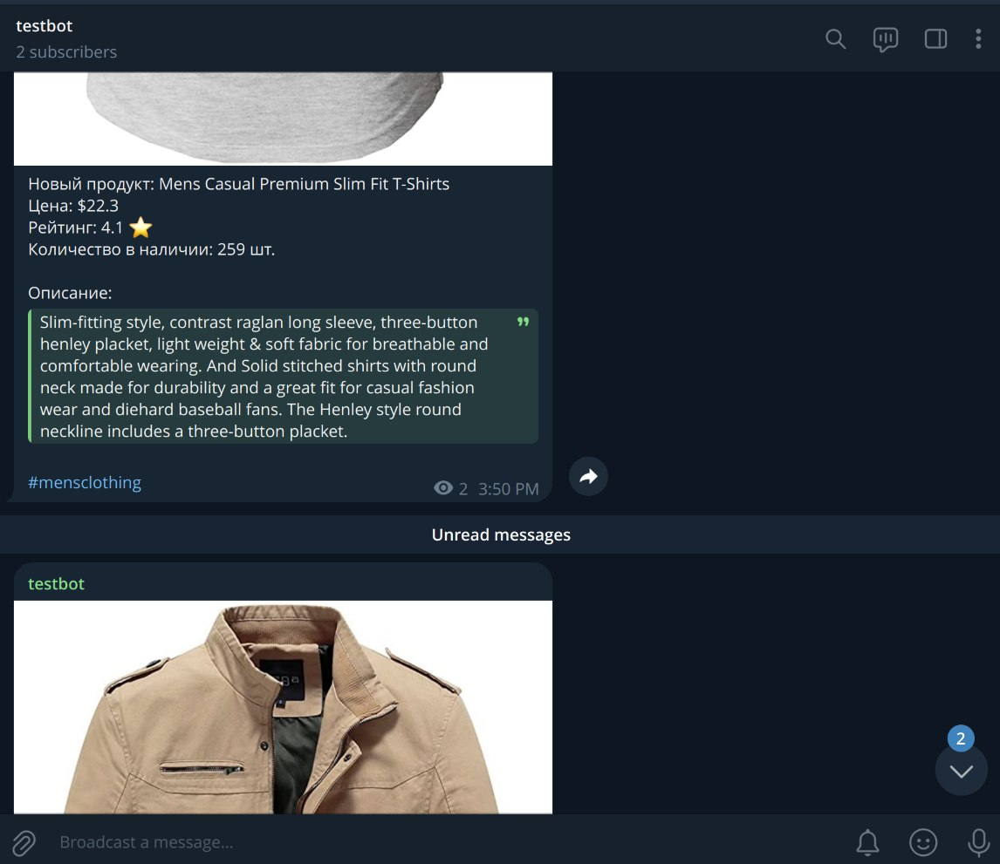

# Telegram Bot: Shop Notifier

Бот, который периодически может публиковать в ваших каналах товары из https://fakestoreapi.com

## Настройка
Требуется создать `.env` файл на основе данных из `.env.example`:
```text
BOT_TOKEN= # токен бота
MONGODB_URI= # uri бд mongodb
MONGODB_DATABASE= # название бд mongodb
FAKE_STORE_API_URI=https://fakestoreapi.com
```

## Запуск
Требуется установленные `nodejs` и `npm` на вашем ПК.
```shell
npm install && npm run start
```

## Использование


